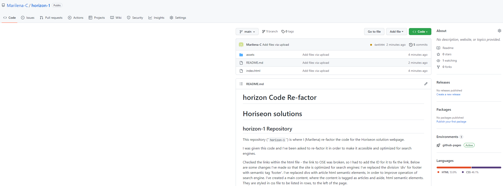

<<<<<<< HEAD
# horizon Code Refactor
<h1 dir = "auto">Horiseon solutions</h1>
<h2 dir="auto"><a id="user-content-horizon-1-repository" class="anchor" aria-hidden="true" href="#the-repository"><svg class="octicon octicon-link" viewBox="0 0 16 16" version="1.1" width="16" height="16" aria-hidden="true"><path fill-rule="evenodd" d="M7.775 3.275a.75.75 0 001.06 1.06l1.25-1.25a2 2 0 112.83 2.83l-2.5 2.5a2 2 0 01-2.83 0 .75.75 0 00-1.06 1.06 3.5 3.5 0 004.95 0l2.5-2.5a3.5 3.5 0 00-4.95-4.95l-1.25 1.25zm-4.69 9.64a2 2 0 010-2.83l2.5-2.5a2 2 0 012.83 0 .75.75 0 001.06-1.06 3.5 3.5 0 00-4.95 0l-2.5 2.5a3.5 3.5 0 004.95 4.95l1.25-1.25a.75.75 0 00-1.06-1.06l-1.25 1.25a2 2 0 01-2.83 0z"></path></svg></a>horizon-1 Repository</h2>

This repository ("<code>horizon-1</code>") is where I (Marilena) re-factor the code for the Horiseon solution webpage. 
  

I was given this code and I've been asked to re-factor it in order to make it accesible and optimized for search engines.

Checked the links within the html file - the link to OSE was broken, so I had to add the ID for it to fix the link.
 Below are some changes I've made so that the site is optimized for search engines:                          
I've replaced the division 'div' for footer with semantic tag 'footer'.
I've replaced divs with article html semantic elements, in order to improve operation of search engine.
I've created a main content, where the content is tagged as articles and aside, html semantic elements. They are styled in css file to be listed in rows, to the left of the page.

I have been using this site to arrange the elements in the page header: https://css-tricks.com/snippets/css/a-guide-to-flexbox/
and https://www.w3schools.com/html/html5_semantic_elements.asp for semantic elements.

The link to the repository called horizon-1 is https://github.com/Marilena-C/horizon-1

The site is live at https://marilena-c.github.io/horizon-1/

=======
# horizon Code Refactor
<h1 dir = "auto">Horiseon solutions</h1>
<h2 dir="auto"><a id="user-content-horizon-1-repository" class="anchor" aria-hidden="true" href="#the-repository"><svg class="octicon octicon-link" viewBox="0 0 16 16" version="1.1" width="16" height="16" aria-hidden="true"><path fill-rule="evenodd" d="M7.775 3.275a.75.75 0 001.06 1.06l1.25-1.25a2 2 0 112.83 2.83l-2.5 2.5a2 2 0 01-2.83 0 .75.75 0 00-1.06 1.06 3.5 3.5 0 004.95 0l2.5-2.5a3.5 3.5 0 00-4.95-4.95l-1.25 1.25zm-4.69 9.64a2 2 0 010-2.83l2.5-2.5a2 2 0 012.83 0 .75.75 0 001.06-1.06 3.5 3.5 0 00-4.95 0l-2.5 2.5a3.5 3.5 0 004.95 4.95l1.25-1.25a.75.75 0 00-1.06-1.06l-1.25 1.25a2 2 0 01-2.83 0z"></path></svg></a>horizon-1 Repository</h2>

This repository ("<code>horizon-1</code>") is where I (Marilena) re-factor the code for the Horiseon solution webpage. 
  

I was given this code and I've been asked to re-factor it in order to make it accesible and optimized for searc engines.

Checked the links within the html file - the link to OSE was broken, so I had to add the ID for it to fix the link.
                                                         
I've replaced the division 'div' for footer with semantic tag 'footer'.
I've replaced divs with article html semantic alements, in order to improve operation of search engine.
I've created a main content, where the cntent is tagged as articles and aside, html semantic elements. They are styled in css file to be listed in rows, to the left of the page.

I have been using this site to arrange the elements in the page header: https://css-tricks.com/snippets/css/a-guide-to-flexbox/
and https://www.w3schools.com/html/html5_semantic_elements.asp for semantic elements.

The link to the repository called horizon-1 is https://github.com/Marilena-C/horizon-1
Your site is live at https://marilena-c.github.io/horizon-1/
>>>>>>> ab562ca5596bbfc73166b9f10961fcc527582e2d
